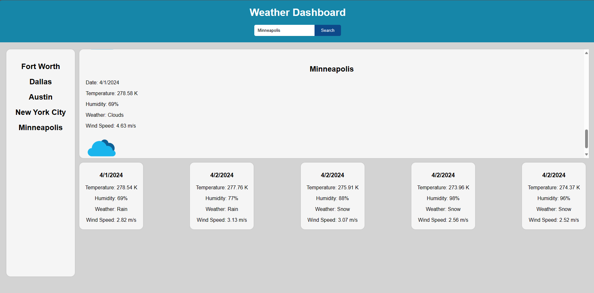

# Weather Dashboard

This is a simple weather dashboard application that allows users to search for cities and view their current weather conditions as well as a 5-day forecast.

## Usage

To use the application, simply enter the name of a city in the search input field and click the "Search" button. The application will fetch the weather data from the OpenWeatherMap API and display it on the page.

## API Integration

The application uses the OpenWeatherMap API to retrieve weather data. The API key is stored in the JavaScript file (`script.js`) and appended to the API URL when making a fetch request.

## Screenshots

## Live Demo

Visit the site here: [Weather Dashboard Live Demo](https://jadehaney.github.io/6-Weather-Dashboard/)

## Repository

View the repo here: [Weather Dashboard Repository](https://github.com/JadeHaney/6-Weather-Dashboard)
